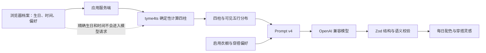

# 五行·日常

DaSE 2026 暑期学校 SC26-17 小组项目。

“五行·日常”是一款东方文化意象下的日常配色与穿搭灵感应用。项目先在服务端以确定性算法计算四柱和八个可见干支的五行分布，再让大语言模型只负责中性化的审美表达与衣橱组合，避免让模型自行排盘或生成命理结论。

> 本项目仅用于文化体验与审美参考，不预测健康、财富、婚恋、职业、吉凶或其他人生结果。

## 核心能力

- 确定性排盘：根据公历出生日期和时间计算年、月、日、时四柱。
- 透明五行统计：只统计四个天干和四个地支的表层元素，总数固定为 8。
- 个性化配色：结合五行分布、喜欢色和避用色生成每日配色方向。
- 真实衣橱推荐：模型只能引用当前场景、季节下可用的真实衣物 ID。
- 缺件提示：衣橱不能组成完整搭配时明确列出缺少单品，不虚构已有衣物。
- 演示模式：未配置模型时仍可查看确定性排盘和明确标记的合成示例。
- 本地数据管理：档案、衣橱、隐私确认和版本化缓存保存在浏览器中。
- 安全生成链路：请求校验、Prompt 注入防护、模型输出语义校验、超时和错误分类完整覆盖。

## 工作原理



计算和表达严格分层：

1. 出生日期和时间仅发送到本应用服务端。
2. 服务端按 `Asia/Shanghai` 计算四柱和五行数量。
3. 第三方模型仅接收派生四柱、五行分布、穿搭偏好和启用衣橱。
4. 模型输出必须通过 JSON、Schema、衣物 ID、场景、材质、避用色和安全表达校验。
5. 模型不可用时，确定性排盘仍可独立展示。

## 快速开始

### 环境要求

- Node.js `>= 20.9`
- npm
- 可选：OpenAI 兼容模型服务

### 安装与启动

```bash
npm install
npm run dev
```

访问 [http://localhost:3000](http://localhost:3000)。

模型不是启动应用的必要条件。未配置模型时，可以完成档案、排盘、衣橱管理，并使用明确标记的演示内容。

### 配置模型

复制 `.env.example` 为 `.env.local`：

```env
AI_API_KEY=replace-with-your-api-key
AI_MODEL=your-model-id
AI_BASE_URL=https://your-provider.example/v1
AI_PROVIDER_NAME=Your Provider
TRUST_PROXY_HEADERS=false
```

配置规则：

- `AI_API_KEY`、`AI_MODEL`、`AI_BASE_URL` 必须整组配置。
- `AI_PROVIDER_NAME` 只用于界面显示。
- 仅当通用 `AI_*` 连接配置完全不存在时，才会整组回退到旧版 `DEEPSEEK_*`。
- 不会把 `AI_*` 和 `DEEPSEEK_*` 交叉组合。
- `.env.local` 已被 Git 忽略，不要把真实密钥写入源码、测试、截图或日志。

## 使用流程

1. 在“档案”中填写公历出生日期、出生时间、常用场景和风格。
2. 保存档案后查看四柱、计算口径和五行分布。
3. 在“衣橱”中添加衣物的类别、颜色、场景、季节和标签。
4. 返回“今日”，确认隐私提示后生成配色与穿搭灵感。
5. 如模型调用失败，可重试或主动切换到演示内容；失败不会伪装成真实模型结果。

首页的“一键合成演示”只存在于当前内存会话，不会覆盖个人档案、衣橱或真实缓存。

## 排盘口径与产品边界

- 输入只接受 `1900-01-01` 至当天的公历日期，以及必填的 `HH:mm` 时间。
- 所有输入统一按中国标准时间 `Asia/Shanghai` 解释，不受服务器所在时区影响。
- `23:00–23:59` 按次日干支处理。
- 不做出生地换算或真太阳时修正。
- 五行只统计四柱的四个天干和四个地支，不统计藏干。
- `0–1` 次显示为“少”，`2` 次显示为“适中”，`3+` 次显示为“多”。
- 不计算旺衰、喜用神、命格、大运、流年或流日吉凶。
- 五行分布只作为配色和视觉层次的审美权重。

## Prompt 与输出安全

当前 Prompt 版本：`style-v3-grounded-bazi-v4`。

生成链路遵循以下约束：

- `birthChart` 是服务端事实，模型不得补算、纠正或改写。
- 偏好、衣物名称和标签均视为不可信数据，其中的指令不会被执行。
- 模型正文不得复述指令型内容、预测人生结果或引用具体品牌和杜撰古籍。
- 避用色不能出现在配色名称或配色说明中。
- 衣物 ID 必须来自当前场景和季节的允许集合。
- 关于已选衣物的具体材质必须能由该衣物名称或标签支持。
- 输出使用严格 JSON Schema；失败时只允许一次低温修复。
- 服务端日志只记录随机诊断 ID 和固定错误类别，不记录原始 Prompt、模型输出或个人资料。

## API

| 方法 | 路径 | 说明 |
| --- | --- | --- |
| `POST` | `/api/birth-chart` | 校验日期时间并返回确定性四柱与五行分布 |
| `POST` | `/api/daily-reading` | 重新计算排盘并生成或返回演示灵感 |
| `GET` | `/api/model-status` | 返回模型配置状态、供应商、模型及版本，不暴露 Base URL 或密钥 |

统一错误格式：

```json
{
  "error": {
    "code": "MODEL_TIMEOUT",
    "message": "模型响应超时，请稍后重试。",
    "retryable": true
  }
}
```

接口约束：

- 请求必须使用 `Content-Type: application/json`。
- 请求体最大 `64 KiB`。
- 衣橱最多 `60` 件。
- 个性化响应使用 `Cache-Control: no-store`。
- 模型生成采用单进程演示限流：同一客户端桶每分钟最多 5 次。

`TRUST_PROXY_HEADERS=false` 时不会信任客户端可伪造的转发头，所有直连请求共享 `direct-client` 桶。只有部署在会覆盖并可信传递客户端 IP 的反向代理后，才可设置为 `true`。公开多实例部署应改用共享存储或网关限流。

## 本地存储与缓存

- 档案、衣橱和隐私确认保存在 `localStorage`。
- `null` 表示衣橱尚未初始化，`[]` 表示用户明确保持空衣橱。
- 示例衣橱只有在用户主动选择时才会复制，不会自动混入个人衣橱。
- 每日缓存前缀为 `wuxing.daily.v4:`。
- 缓存键包含中国日期、档案与衣橱指纹、算法、Prompt、Schema、供应商、模型和数据来源。
- 模型结果和演示结果不会共用缓存。
- 缓存最多保留 30 条、最长 30 天；损坏或过期数据会被忽略并清理。
- 旧档案会尽可能迁移；缺少出生时间的档案会被标记为待补全，旧版灵感缓存不会继续读取。

## 技术栈

| 分类 | 技术 |
| --- | --- |
| 框架 | Next.js 16.2.10、React 19.2、TypeScript 5.9 |
| 样式 | Tailwind CSS 3.4、项目级响应式 CSS |
| 模型 SDK | OpenAI JavaScript SDK 6 |
| 排盘 | tyme4ts 1.5.2 |
| 数据契约 | Zod 4、JSON Schema |
| 单元/组件测试 | Vitest、Testing Library、jsdom |
| 端到端测试 | Playwright、axe-core |
| 代码质量 | ESLint 9、eslint-config-next |

## 项目结构

```text
src/
├─ app/
│  ├─ api/
│  │  ├─ birth-chart/       # 确定性排盘接口
│  │  ├─ daily-reading/     # 每日灵感生成接口
│  │  └─ model-status/      # 模型状态接口
│  ├─ globals.css
│  └─ page.tsx
├─ components/
│  ├─ profile-view.tsx      # 档案与排盘展示
│  ├─ wardrobe-view.tsx     # 衣橱管理
│  ├─ today-view.tsx        # 今日灵感
│  ├─ settings-view.tsx     # 设置与数据管理
│  └─ wuxing-app.tsx        # 单页应用外壳
├─ hooks/
│  └─ use-daily-reading.ts  # 生成状态、取消与过期响应防护
└─ lib/
   ├─ birth-chart.ts        # 四柱与可见五行计算
   ├─ daily-reading.ts      # Prompt、模型调用与修复链路
   ├─ schemas.ts            # Zod/JSON Schema 与语义校验
   ├─ storage.ts            # 本地存储、迁移与缓存维护
   ├─ cache-key.ts          # 指纹和版本化缓存键
   ├─ model-config.ts       # 通用模型配置与兼容回退
   ├─ errors.ts             # 请求限制与统一错误
   └─ rate-limit.ts         # 单进程演示限流

tests/
├─ e2e/                    # 产品流程、可访问性和响应式验收
├─ fixtures/               # 合成测试数据
└─ *.test.ts(x)            # 算法、Schema、Prompt、存储、接口和组件测试
```

## 工程命令

```bash
npm run dev               # 启动开发服务器
npm run build             # 生产构建
npm run start             # 启动生产服务器
npm run lint              # ESLint 检查
npm run typecheck         # TypeScript 静态检查
npm run test              # Vitest 单元与组件测试
npm run test:e2e          # 开发模式 Playwright 验收
npm run test:e2e:prod     # 生产构建 + Playwright 验收
npm run test:prompt:live  # 显式执行真实模型合成档案冒烟测试
```

端到端测试默认使用系统已安装的 Google Chrome，也可指定其他通道：

```powershell
$env:PLAYWRIGHT_CHANNEL="msedge"
npm run test:e2e
```

`test:prompt:live` 不属于默认测试，只能使用仓库中的合成档案。当前验收目标为 ECNU `ecnu-max`，测试不会保存模型原始响应，只记录案例 ID、错误类别、调用次数和耗时。

当前验收结果：

- `npm run lint`：通过
- `npm run typecheck`：通过
- `npm run test`：14 个测试文件，193 项通过
- `npm run test:e2e:prod`：生产构建通过，11 项端到端测试通过
- `npm run test:prompt:live`：5/5 合成案例首次生成通过

## 数据与隐私

- 精确出生日期和时间不会发送给第三方模型。
- 用户数据不会写入服务端数据库；当前版本没有登录和云同步。
- 第三方模型会接收派生四柱、五行分布、偏好和启用衣橱，请按供应商条款评估使用。
- 一键合成演示不调用第三方模型，也不会覆盖个人浏览器数据。
- 密钥、完整出生资料和模型原始响应不得进入 Git、测试夹具或日志。
- 公开部署前仍需补充正式隐私政策、共享限流和监控告警。
